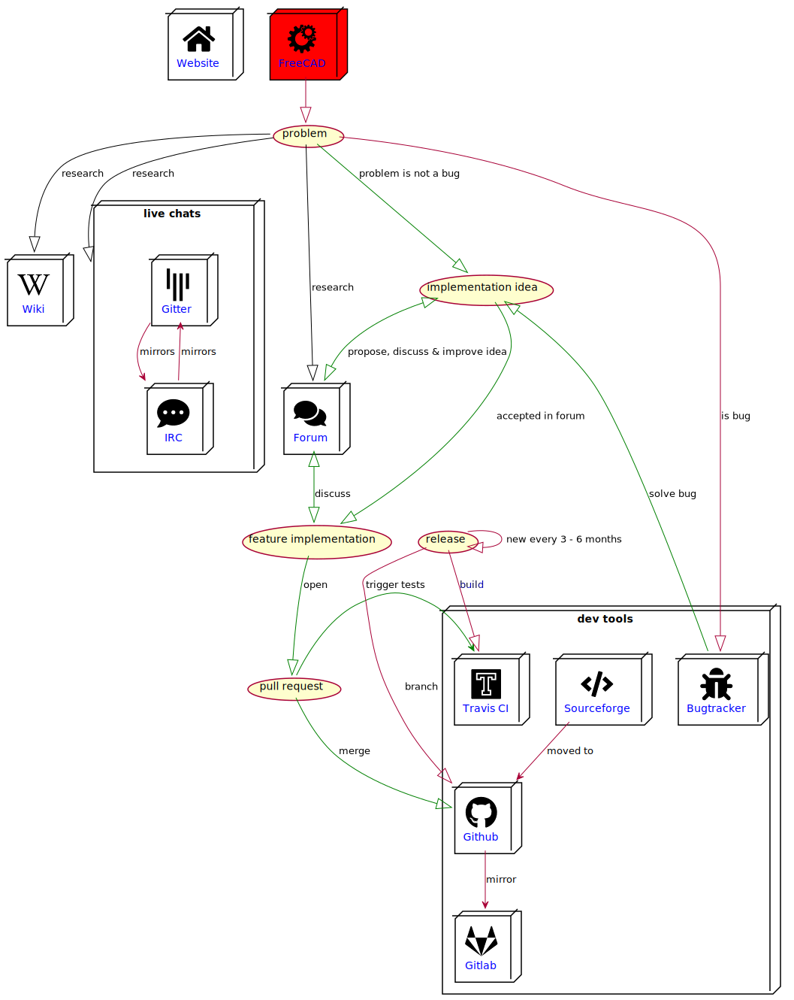

# freecad development graphic
This is my attempt at documenting the workflow of the FreeCAD development process. You can compile the [PlantUML](https://plantuml.com) file on [planttext.com](https://www.planttext.com). The PlantUML compatible icons used are from this [repository](https://github.com/tupadr3/plantuml-icon-font-sprites). The links in the graphic are clickable if you open the [raw graphic file](https://raw.githubusercontent.com/kryptokommunist/freecad_development_graphic/master/development.svg).

